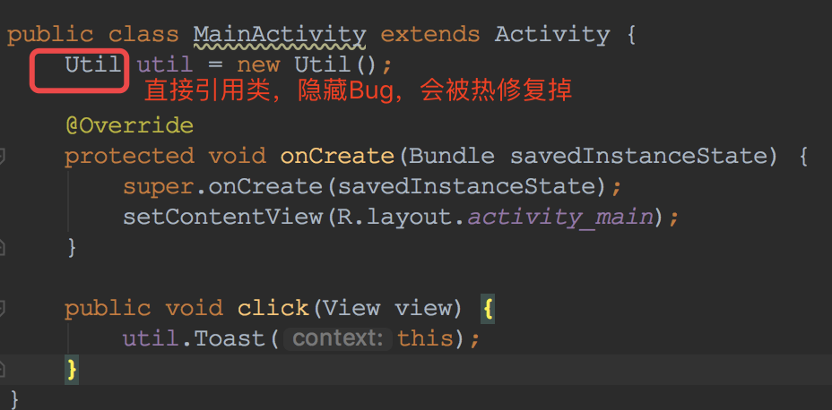
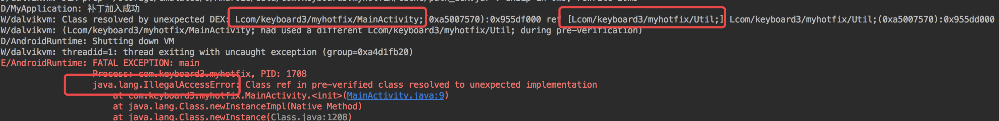
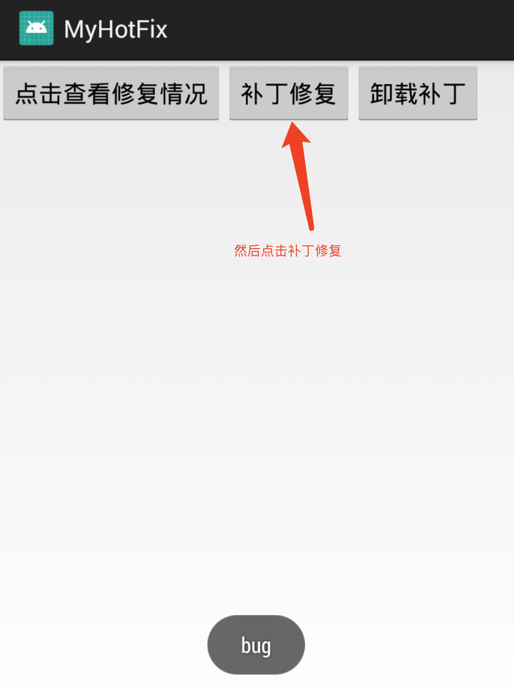

# MyHotFix
插桩方式防止打  CLASS_ISPREVERIFIED 标记
启动时反射补丁到 DexElements 数组最前面

# 插桩原因
插桩方式绕过davike虚拟机第一次启动时将class.dex经过dexopt优化成odex时打上的于校验标记。
在davike虚拟机下，如果不插桩通过classLoader+反射的方式实现会出现IllegalAccessError错误




# 插装实现
插桩实现部分参考了 [nuwa](https://github.com/jasonross/Nuwa)
- 生成hack.apk（我直接拿nuwa的用）
- 创建gradle plugin注册Transfrom
- 过滤出我们需要的class,通过ASM在<init>构造方法中添加hack类的引用
- 在check**manifests task处理之前将hack.apk放到assert目录下
# 冷启动实现
- 将需要修复的补丁patch_dex.jar放到sdcard/Android/data/包名/cache/下
- 在Application的attachContext中将hack.apk以及patch_dex.jar通过DexClassLoader加载出来
- 分别反射提取dex插入到PatchClassLoader中dexElements数组中

# 效果



# python 脚本打 patch_dex 补丁
```python
#coding:utf-8
import os
import sys;  
import os;

sourcehost="/Users/ganchunyu/work/AndroidProject/MyHotFix"
classfullName="com.keyboard3.myhotfix.Util";
index=classfullName.rfind(".");
nohandle=classfullName[:index];
handle=nohandle.replace(".","/");
fileName=classfullName[index+1:]+".class";
outputClassPath=sourcehost+"/app/build/intermediates/classes/debug/"+handle+"/"+fileName;
targetHost="/Users/ganchunyu/work/workspace/patch/";
targetPatch=targetHost+handle;

os.chdir(targetHost);

print "创建目录",os.path.exists(targetPatch)
if not os.path.exists(targetPatch):
	os.makedirs(targetPatch)
int1="cp "+outputClassPath+" "+targetPatch;
int3="jar cvf path.jar *";
int4="dx --dex --output=path_dex.jar path.jar";
int5="adb -e push path_dex.jar /sdcard/Android/data/"+nohandle+"/cache";
print int1
os.system(int1);
print int3
os.system(int3);
print int4
os.system(int4);
print int5
os.system(int5);
```